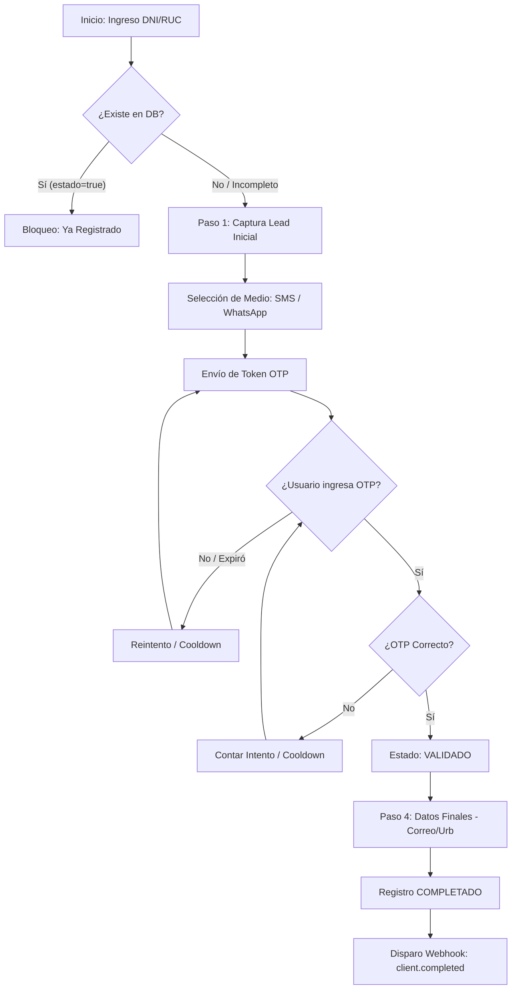

# Documento Técnico — TOKENIZER HUANCAYO
**Fecha:** 17-02-2026 | **Versión:** 3.0

---

## 1. Flujo del Sistema (Flowchart)

A continuación se detalla el flujo de decisión y estados del proceso de registro:

---

## 2. Definición del Stack Tecnológico

El proyecto se basa en un stack optimizado para alta concurrencia y baja latencia.

### 2.1 Backend: Node.js & Express
*   **Node.js (v20 LTS):** Elegido por su modelo de E/S no bloqueante, ideal para manejar miles de conexiones simultáneas durante el envío masivo de tokens.
*   **Express 5:** Proporciona una estructura minimalista que reduce el "overhead" del servidor, permitiendo tiempos de respuesta <100ms.

### 2.2 Frontend: Vanilla JavaScript (Web Standards)
*   **Fidelidad Móvil:** Al no usar frameworks (React/Angular), el peso de la página es <50KB. Esto garantiza que funcione en zonas con 3G o señal inestable.
*   **Cero Dependencias:** Maximiza la compatibilidad con navegadores antiguos y reduce vulnerabilidades de seguridad en el cliente.

### 2.3 Base de Datos: PostgreSQL 15
*   **Justificación:** Se prefiere sobre MySQL o MongoDB por su cumplimiento **ACID** estricto. En validaciones de identidad, la consistencia es innegociable.
*   **JSONB Support:** Permite almacenar metadatos de las operadoras SMS en formato flexible sin perder el rendimiento de una BD relacional.
*   **Managed Ready:** La compatibilidad nativa con Render Managed Postgres asegura backups y redundancia de datos.

### 2.4 DevOps: Docker & Render
*   **Docker:** Garantiza que el software corra exactamente igual en QA que en Producción.
*   **Render (PaaS):** Elegido por su facilidad para gestionar servicios dockerizados con **SSL automático**, **Auto-scaling** y **Zero-Downtime Deploys**.

---

## 3. API y Webhooks

### Base URL: `https://api.sms-informaperu.com/`

### Eventos de Webhooks
Los webhooks permiten que el sistema del cliente reaccione automáticamente:
*   **`client.registered`**: Notifica cuando se captura un DNI (Lead frío).
*   **`client.validated`**: Notifica cuando se confirma el celular (Lead caliente).
*   **`client.completed`**: Notifica el cierre del registro con datos finales (Conversión).

---

## 4. Ambientes y Despliegue

| Aspecto | QA (Docker Local) | Producción (Render) |
|---|---|---|
| **API** | `localhost:3000` | Render Web Service (Docker) |
| **DB** | PostgreSQL Alpine | Render Managed PostgreSQL |
| **Persistencia WA** | Local Folder | Render Persistent Disk |
| **Seguridad** | Básica | IP Pinning + Rate Limit + HTTPS |

---

## 5. Capacidad y Cooldown
*   **Objetivo:** 2M registros en 10 meses.
*   **Cooldown Progresivo:** Evita ataques de fuerza bruta y reduce costos por SMS fallidos.

| Intento | Tiempo de Espera |
|---|---|
| 3 | 1.5 minutos |
| 4 | 3 minutos |
| 5 | 5 minutos |
| 6 | 10 minutos |
| 7 | 30 minutos |
| 8+ | 1 hora |

---
*Documento de Propuesta Técnica - 2026*
